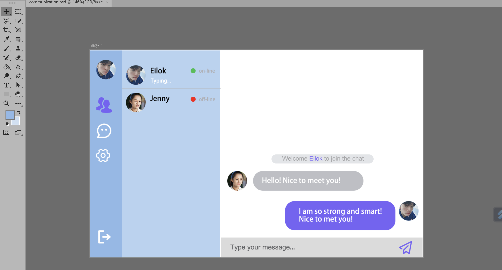

# Personal Website Report  

## Overall Design
* ### Web art and style design
    Fashion and simplicity are core concept of the website. The dominant color of the website is wathet blue. Light purple and white are used to decorate text and elements. The lighter color will make a fresh impression on users.  
      
    I adopt the style of card to be the art of this website. Just like my calling card in the introduction page and the articles of my hobbies in the about page. All contents are included in a card. This kind of design contrasts well with the background and enhances the visual effect.

* ### Page layout
    The whole website adopts responsive design method. Firstly, I define font size of html label using vw unit so that the font size can change with the width of web viewport.   
    ```css
    html {
        font-size: 0.78125vw;
    }
    ```
    Then, I style the elements by rem unit or percentage. In this way, no matter how screen changes, the layout of website is relatively constant, in which reducing the use of horizontal scroll bars and enabling user to see the whole content in any situation. In addition, Flexbox and grid are sometimes used to arrange elements. For example, the whole page of chat application is organized by grid layout.  
    ```css
    .grid-container {
        display: grid;
        grid-template-columns: 1fr 3fr 8.815fr;
        grid-column-gap: 0;
        grid-template-rows: 10fr 1fr;
        height: 100vh;
    }
    ```

* ### Basic feature
    1. Navigation system  
    The navigation bar are added at the top of introduction page and about page. You can click specified tab and then jump to the other page. In the chat application, you can click the exit button at the bottom left corner and return to the previous page.
    2. Introduction page  
    You can see my basic information in this page. Besides, the site map is attached below to illustrate the content of other pages.
    3. About page  
    I introduce the details of my hobbies in this page, including the stories. You can fully learn my interests here.
    4. Chat application page  
    You will be asked to login with nickname when you open this page. The leftmost sidebar is control strip. Except for the user list and exit buttons, other buttons are still being developed. Then, the right of control strip is the user list in which you can check the total number of current users and all user's name. The hint of typing will also be printed on this bar. The rightmost area is chat interface. You can click the send button and send your message to other users.  

## Details of chat application implementation
*  ### User login
    On the client side, when the server is connected, the login page will be displayed by `socket.on('connect', function)` method. Then, user can sign up their nickname by pressing "sign in" button. To achieve this function, I firstly add click event to "sign in" button and emit username to server side through `socket.emit('login', username)`. Next, the server side maintains a user's array and will check if 'username' has existed and return result to client side by receiving 'login' event. If the username has existed, `socket.emit('nameExisted')` will be run. Otherwise, `socket.emit('loginSuccess')` will be executed.

* ### Notification to the existing users when a new user joins and a current user exits.  
    On the client side, I use `socket.on('system', function)` to handle user login and exit events. The function receives three parameters username, user's array and event's type. The event's type is used to judge user's behaviour. On the server side, I add `io.sockets.emit('system', username, arrStr, 'login')` below loginSucess event to send entry event to all online users. For user's logout, `socket.on('disconnect', function)` is used to judge if user has exited. If user exits, `socket.broadcast.emit('system', socket.username, arrStr, 'logout')` will be executed to announce users who still is online. Finally, when client side receives request from server side, it display the message on the chat box.

* ### Showing a list of users currently within a chat  
    I achieve user list in 'system' event I have mentioned above on the client side. That is `socket.on('system', function(username, usersArr, type){})`. 'usersArr' is an array that contains all online usernames. When the function receives array from the server, it will renew user list by adding new elements.

* ### Showing messages  
    I divide messages into two types, own message and other user's messages. They have different styles. But I sort them into one _sendNewMsg function on the client side so that I can call it conveniently.  
    When send button is clicked, `socket.emit('userMsg', msg)` will be executed to send user message to the server. Then, I use `socket.on('userMsg', function(msg) {})` on the server side to receive new message. After, `socket.broadcast.emit('userMsg', socket.username, msg, 'other')` is run to send this message to all users except for sender. On the client side, `socket.on('userMsg', function(user, msg, type){})` respond the server's request and display message to all other users by _sendNewMsg function.  

* ### Informing the other users when a user is typing a message  
    When the input field is focused and not empty, we can know that user is typing. In this situation, `socket.emit('typing')` send typing event to the server. The server receives this request and informs all users by `io.emit('typing', socket.username)`. In this way, client side recognizes which user is typing and prints 'typing' hint on the user list.
    When the input field lose focus, we can know that user stops typing. Now, just as the method that user is typing, I clear the typing prompt and make sure program run correctly.

## Challenges
* ### Responsive Design  
    I had no idea how to achieve responsive website at first. During the exploration, I tried many ways to implement it such as media query and mixture of vh, vw unit. But all of them failed. Finally I found a methd that setting html font size to suit the width of viewport and it seems successful. But a new question emerge. When page zooms, the position of elements seems no work. So I banned zoom feature by JavaScript.  
* ### User's login and sign up  
    In the initial design, I planned to add upload function of portrait and registration function for user to login so that user can use only one account to login chat room. However, the transmission of file between the client and the server and saving user's account both require more professional knowledge. So I just make it a temporary chat application. The following is the first draft.
    

## References
[1]: Chat application sample https://www.cnblogs.com/wayou/p/hichat_built_with_nodejs_socket.html#!comments